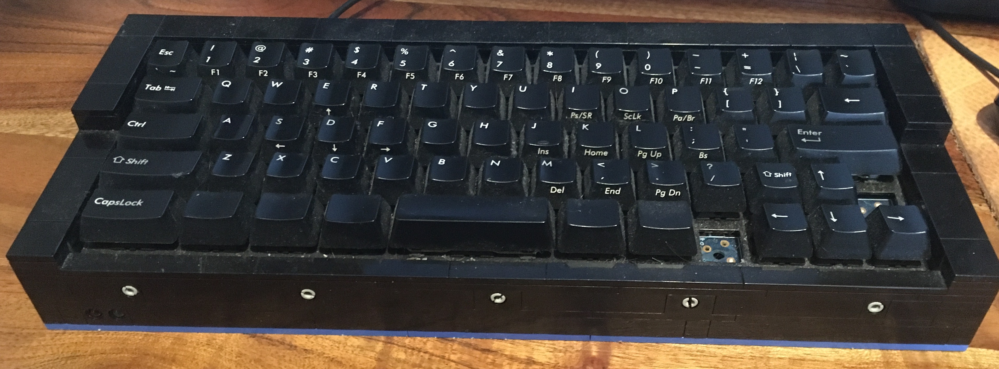

# Higgs Keyboards

Keyboards made by Jon Higgs featuring:

- Handmade wooden cases
- Point-to-point Wiring
- Open Source Firmware (T.M.K.)
- Completely repairable.
- Foot Switch ports
- 6 Key Roll Over

## ML67

[full details](./keyboard/H0000-ml67)

## ML65

[full details](./keyboard/H0001-ml65)
