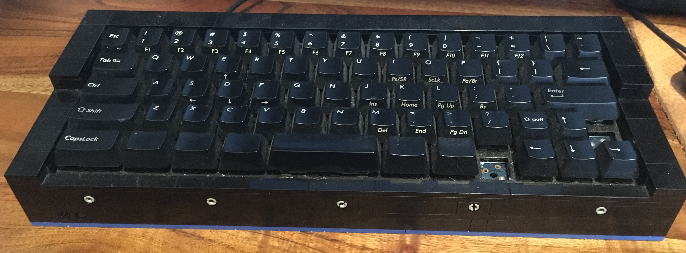
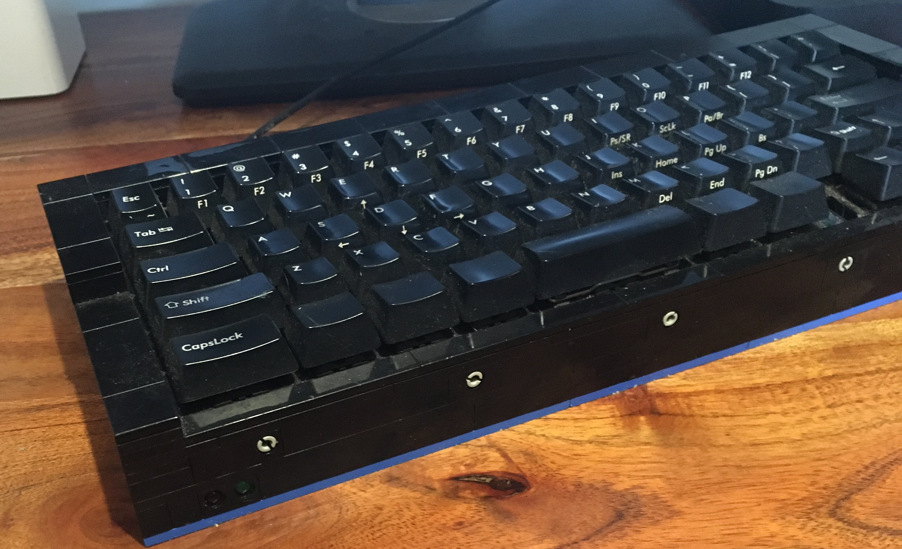
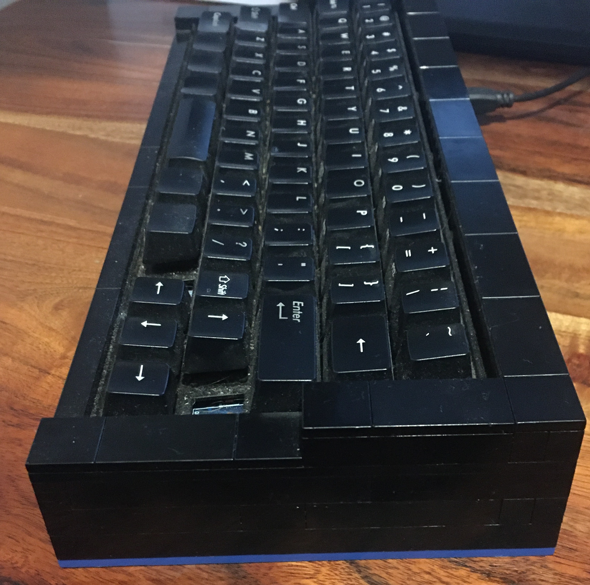
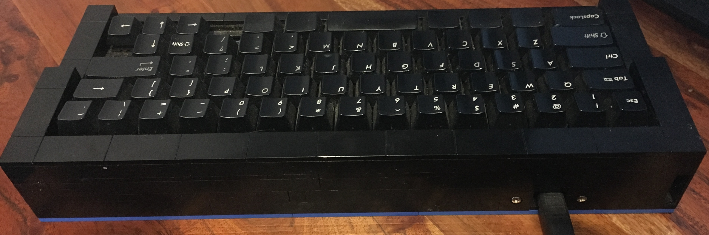

# ML67

A highly modified Filco Minila. Recommended for us on Linux.

- Serial: H0000
- Date: 07/05/2015
- Key Switches: Cherry Blue
- Number of Keys: 65
- Height:
- Keyboard Angle:
- Case Material: Lego
- Key Cap Material: ABS Plastic
- Controller: Teensy 2
- Connector: USB Type B

