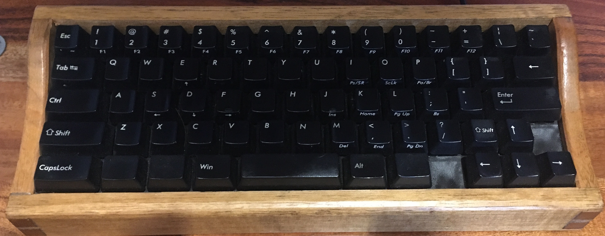
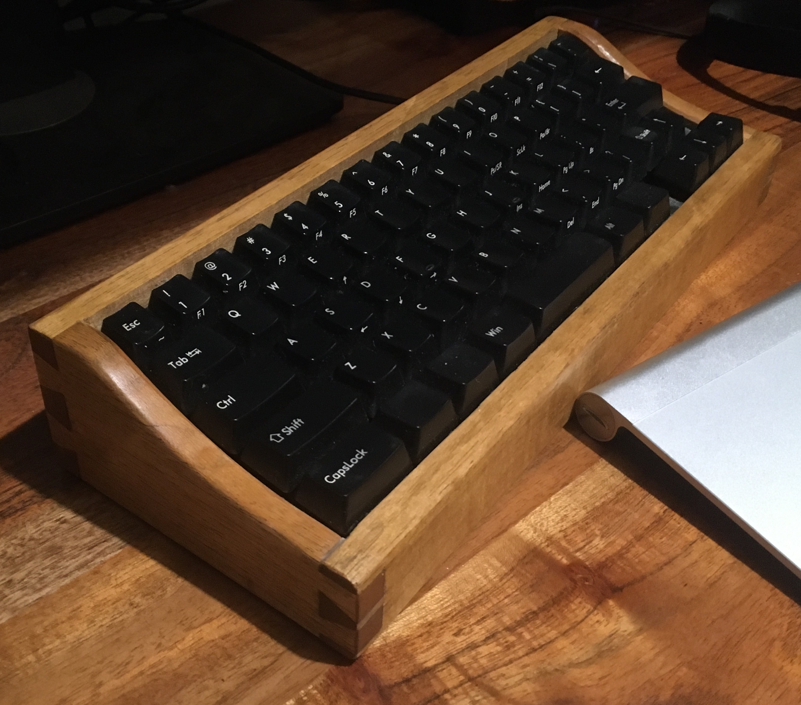

# ML65

A highly modified Filco Minila. Recommended for us on MacOS.

- Serial: H0001
- Date: 27/04/2019
- Key Switches: Cherry Blue
- Number of Keys: 65
- Height:
- Keyboard Angle:
- Case Material: Victorian Ash
- Key Cap Material: ABS Plastic
- Finish: Shellac
- Controller: Teensy 2
- Footswitch Ports: 1
- Connector: USB Type Mini-B

Points of note:

- The keyboard backplate cannot be removed from the case.

